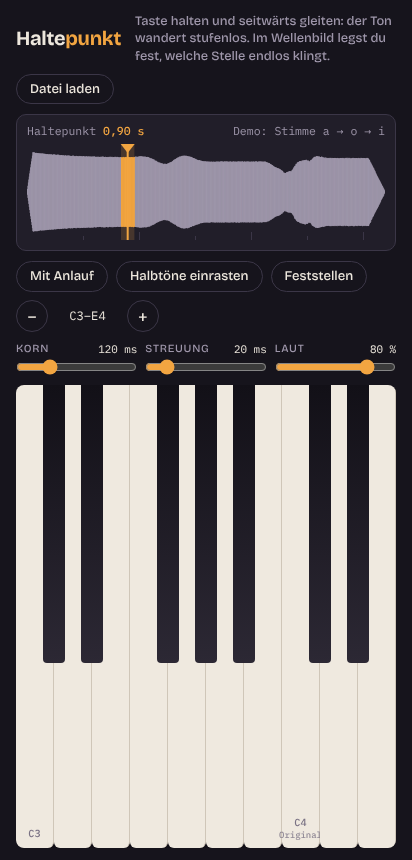

# Haltepunkt-Klavier

**[APK herunterladen](../releases/haltepunkt-klavier-1.0.apk)** · [Quellcode](../apps/haltepunkt-klavier/index.html)

Eine Android-App, mit der man einen Ton beliebig lange hält und ihn durch Wischen stufenlos in der Tonhöhe verschiebt, ähnlich einem Bending auf der Gitarre.

## Funktionen

- Ton halten an einem frei gewählten Punkt und per Finger in der Tonhöhe verschieben
- Eigene Klänge laden
- Funktioniert offline, hält den Bildschirm an
- Im Querformat mehr Tasten

## Umsetzung

Zuerst als HTML/JavaScript-Prototyp mit Web Audio, dann als native Android-App in Java. Gebaut ohne Android Studio, direkt mit der Toolchain: aapt2, javac, d8, zipalign, apksigner.

**Ergebnis:** signierte APK für Android 7.0 und neuer (minSdk 24, targetSdk 34)

## Klangengine

Der gehaltene Ton entsteht durch granulare Synthese: Die App spielt laufend kurze, sich überlappende Klangkörner aus der gewählten Stelle ab (Hann-Fenster, vierfache Überlappung). Die Tonhöhe ergibt sich aus der Abspielgeschwindigkeit. Zum Ausprobieren erzeugt die App beim Start selbst eine gesungene Demo-Stimme, die per Formant-Synthese von „a“ über „o“ zu „i“ wechselt.
