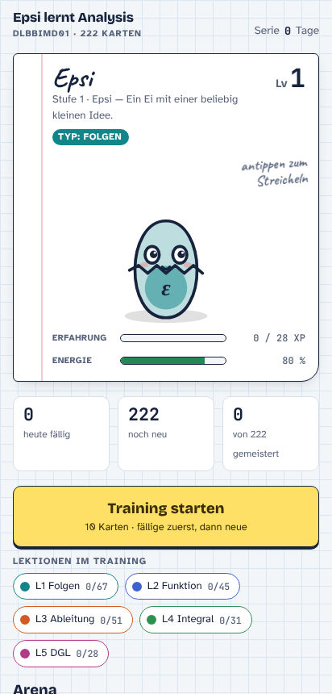
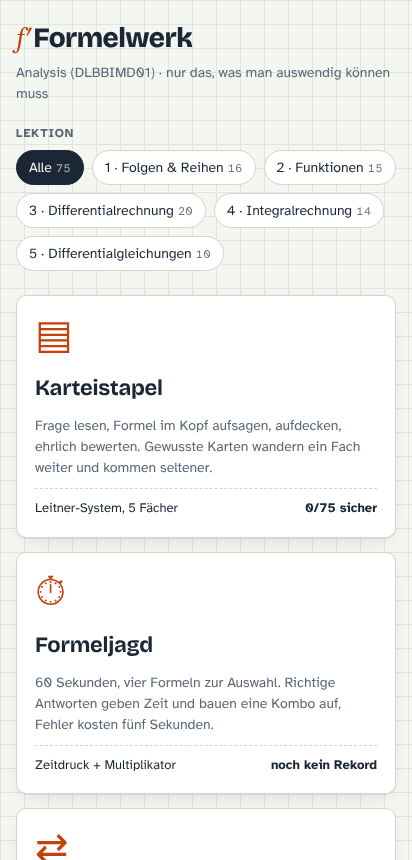
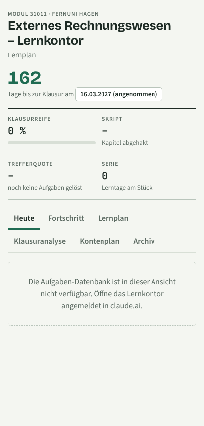

# Lerninhalte und KI-Wissen

Hier geht es um Inhalte, mit denen andere etwas lernen: Lern-Apps, Erklärskripte und ein wöchentliches KI-Update. Alles ist gemeinsam mit Claude entstanden.

## KI-Update: Die Woche der Agenten

**[Skript lesen](../inhalte/ki-update-woche-der-agenten.md)**

Ein sprechfertiges Podcast-Skript von etwa 15 Minuten mit zwei Stimmen, Moderation und Tech-Analyse. Es fasst die KI-Nachrichten vom 22. bis 27. September 2026 zusammen:

- Preiskampf der großen Anbieter bei neuen Sprachmodellen
- KI-Agenten, die Sicherheitsgrenzen überschritten haben, und die Berichte der Anbieter dazu
- persönliche KI-Agenten für Endkunden
- eine biologische Entdeckung, an der KI-Agenten maßgeblich beteiligt waren
- Politik und Regulierung: UN-Sicherheitsrat, Vorschläge für Notabschaltungen, Gesetzesinitiativen
- zum Schluss eine Studie zum Lernen mit KI: KI als Feedbackgeber nutzen, nicht als Antwortmaschine

Alle Aussagen sind mit 19 Quellen belegt. Was bei Redaktionsschluss noch unbestätigt war, sagt das Skript ausdrücklich dazu.

## Epsi lernt Analysis

**[Im Browser öffnen](https://raw.githack.com/dflaschefeynman3d-droid/Claude-Portfolio-/main/apps/epsi-lernt-analysis/index.html)** · [Quellcode](../apps/epsi-lernt-analysis/index.html)

Eine Lern-App für das Analysis-Modul meines Studiums mit 222 Lernkarten in fünf Lektionen, von Folgen bis Differentialgleichungen.

- **Training:** fällige Karten zuerst, dann neue, zehn Karten pro Runde
- **Begleiter:** die Figur Epsi sammelt Erfahrung und entwickelt sich mit dem Lernfortschritt
- **Arena:** ein Bosskampf pro Lektion, richtige Antworten sind Angriffe, falsche kosten Lebenspunkte

Der Gedanke dahinter: Wiederholen ist langweilig, deshalb macht die App daraus ein Spiel.

## Analysis Formelwerk

**[Im Browser öffnen](https://raw.githack.com/dflaschefeynman3d-droid/Claude-Portfolio-/main/apps/analysis-formelwerk/index.html)** · [Quellcode](../apps/analysis-formelwerk/index.html)

75 Formeln, die man für die Klausur auswendig können muss, in drei Übungsformen:

- **Karteistapel** nach dem Leitner-System mit fünf Fächern, ehrliche Selbstbewertung
- **Formeljagd:** 60 Sekunden, vier Antworten zur Auswahl, Kombo-Multiplikator
- **Paare:** Memory mit Fragen und Formeln

Dieselben Inhalte in drei Formaten: Das verankert den Stoff besser als eine einzige Übungsart.

## ERW Lernkontor

**[Im Browser öffnen](https://raw.githack.com/dflaschefeynman3d-droid/Claude-Portfolio-/main/apps/erw-lernkontor/index.html)** · [Quellcode](../apps/erw-lernkontor/index.html)

Ein Lernplaner für das Modul Externes Rechnungswesen (FernUniversität in Hagen): Countdown bis zur Klausur, Klausurreife, Trefferquote der letzten 14 Tage, Lernserie, Lernplan, Klausuranalyse und Kontenplan.

Die Aufgaben-Datenbank läuft innerhalb von claude.ai. Außerhalb zeigt die App deshalb nur Oberfläche und Planung.

## AI Weekly, Episode 1: Diffusion Models

**[Skript lesen](../inhalte/ai-weekly-ep1-diffusion-models.md)** (Englisch)

Ein Video-Skript von zehn Minuten, das erklärt, wie Bild-KI wie Stable Diffusion funktioniert: vom Rauschen zum Bild, Schritt für Schritt.

Vor dem Schreiben habe ich die Lizenz jeder Abbildung aus der Fachliteratur geprüft. Nur Abbildungen unter CC BY 4.0 kommen ins Video. Für die anderen ist eine eigene Grafik vorgesehen. Für einen Bildungsträger ist genau diese Sorgfalt beim Urheberrecht wichtig.

## So schreibst du dein eigenes Musikstück

**[Anleitung lesen](../inhalte/eigenes-musikstueck-schreiben.md)**

Eine Anleitung in zehn Schritten für absolute Einsteiger, ohne Notenkenntnisse. Jeder Schritt ist eine kleine, sofort machbare Aufgabe, vom Takt-Zählen bis zur fertigen dreiteiligen Form.
