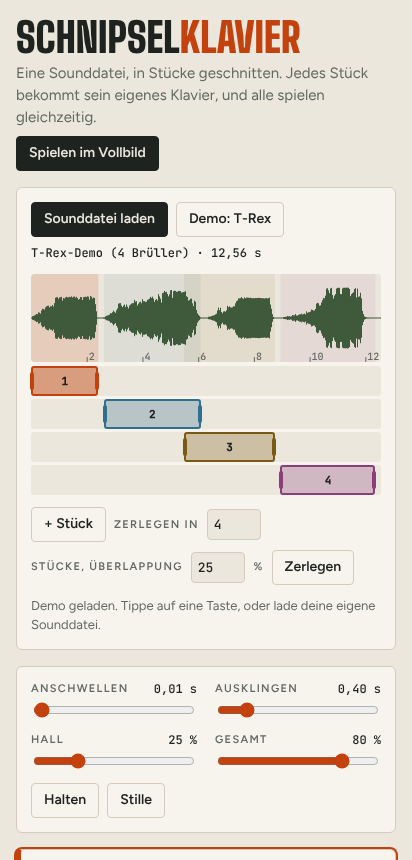

# Schnipselklavier

**[Im Browser spielen](https://raw.githack.com/dflaschefeynman3d-droid/Claude-Portfolio-/main/apps/schnipselklavier/index.html)** · **[APK herunterladen](../releases/schnipselklavier-1.1.apk)** · [Quellcode](../apps/schnipselklavier/index.html)

Ein Sampler, der eine Audiodatei in Stücke schneidet (auch überlappend) und jedes Stück auf einer eigenen Tastatur spielbar macht. Alle Tastaturen lassen sich gleichzeitig bespielen.

## Funktionen

- Mehrere Klaviere untereinander, je zwei Oktaven (C3–C5)
- Oktave höher/tiefer, Schleife, Schneiden, Halten, Stummschalten
- Im Querformat ein Vollbild-Spielmodus

## Umsetzung

Web-Version mit Web Audio, Android-App in Java mit derselben Toolchain wie das [Haltepunkt-Klavier](haltepunkt-klavier.md). Entstanden aus einem früheren Experiment, einer Sampler-Orgel mit Dinosaurier-Gebrüll.

**Ergebnis:** signierte APK Version 1.1 und Web-Version
